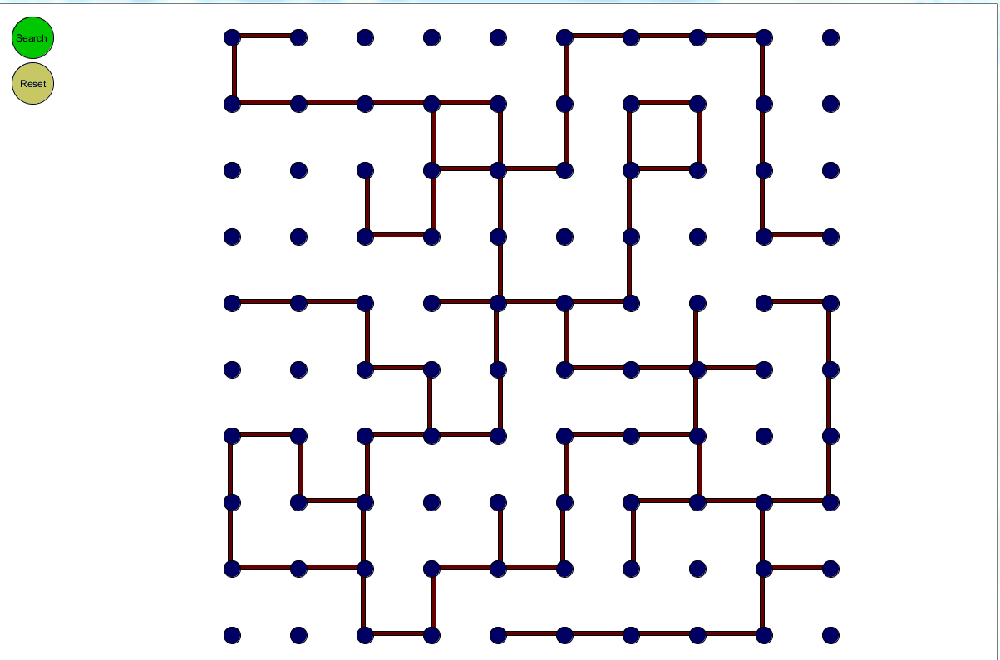

# Maze-Solver-Simulator
A simulator to visualise path finding algorithm. The implementation of Graph and Depth First Search Algorithm is in C and interface is 
designed in Java using Processing. Function calling is done via Java Native Interface. 

# Screen

