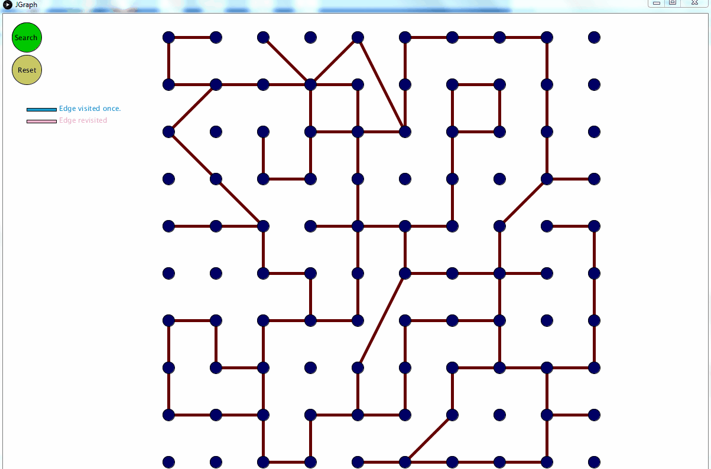

# Maze-Solver-Simulator
A simulator to visualise path finding algorithm. The implementation of Graph and Depth First Search Algorithm is done in C and interface is designed in Java using Processing. The program in Java is interfaced with C program using Java Native Interface. The program algorithm can be implemented on a real bot which needs to find a goal node through a maze as there is no jumps between unrelated nodes. This is done by maintaining a stack to back trake to unvisited node form a visited node. 

# Screen

